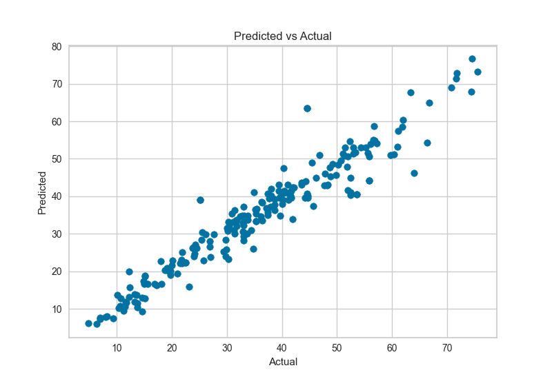
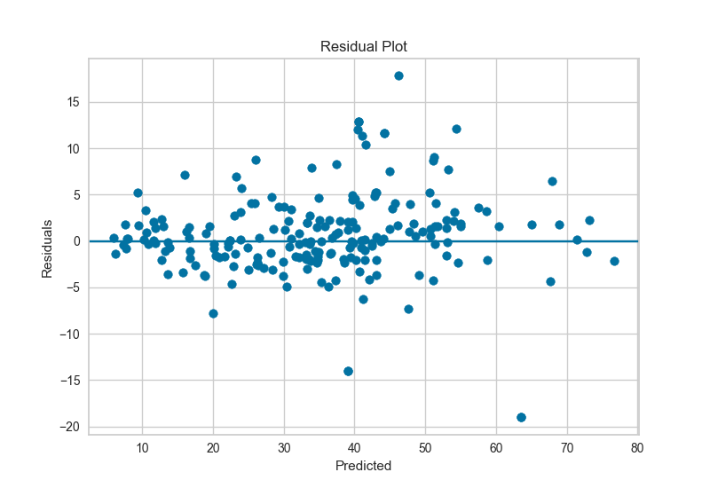
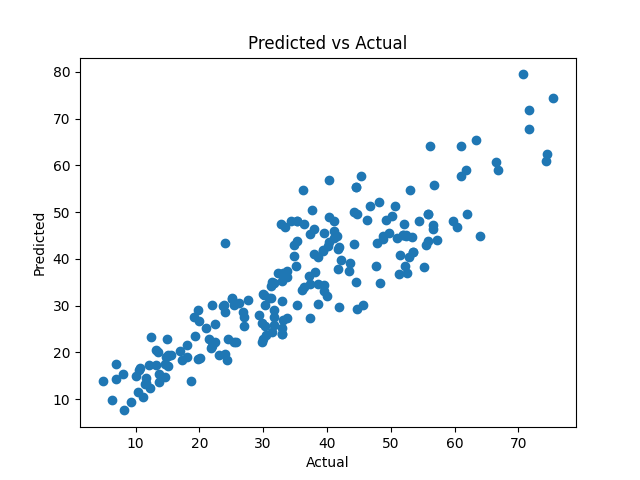
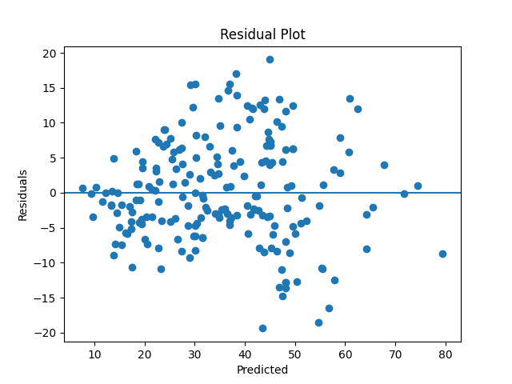
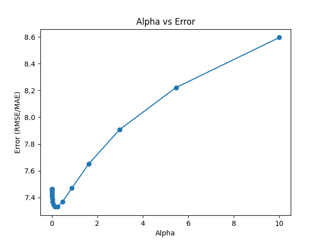

# **Midterm MLOps**
``` Identity
Name     : Muhamad Nur Rasyid
NRP      : 3324600018
Class    : 2 D4 SDT-A
Lecturer : Renovita Edelani S.Kom, M.Tr.Kom.
Topic    : MLOps Midterm -- Regression
```
---
## **Overview**

### **Tree**
```
MLOps-Midterm mymacbook$ tree
.
├── README.md
├── __init__.py
├── automl_run.py
├── data
│   └── Concrete_Data.xls
├── manuals_run.py
├── requirements.txt
├── results
│   ├── alpha_vs_error.png
│   ├── automl
│   │   ├── metrics.json
│   │   └── null.json
│   ├── logs.json
│   ├── manuals
│   │   ├── logs_20260419_055427.json
│   │   └── null.json
│   ├── pred_vs_actual_auto1.png
│   ├── pred_vs_actual_manual.png
│   ├── residuals_auto1.png
│   └── residuals_manual.png
├── run_pycaret.ps1
├── run_pycaret.sh
├── setup_venv.ps1
├── setup_venv.sh
├── setup_venv_codespace.sh
└── src
    ├── __init__.py
    ├── automl
    │   ├── __init__.py
    │   └── functions.py
    ├── automl_pipeline.py
    ├── evals
    │   ├── __init__.py
    │   └── metrics.py
    ├── logger
    │   ├── __init__.py
    │   └── logger.py
    ├── manuals
    │   ├── __init__.py
    │   └── regression
    │       ├── __init__.py
    │       └── ridge.py
    ├── pipeline.py
    ├── prep
    │   ├── __init__.py
    │   ├── imputer.py
    │   └── norm.py
    ├── tuner.py
    └── visuals
        ├── __init__.py
        └── visualizer.py
```
### **Tentang Data**
Data yang saya gunakan adalah data tentang Kualitas Beton (Concrete) yang dimana ia memiliki 9 kolom (8X, 1y)
``` cols
[
Cement (component 1)(kg in a m^3 mixture),
Blast Furnace Slag (component 2)(kg in a m^3 mixture),
Fly Ash (component 3)(kg in a m^3 mixture),
Water  (component 4)(kg in a m^3 mixture),
Superplasticizer (component 5)(kg in a m^3 mixture),
Coarse Aggregate  (component 6)(kg in a m^3 mixture),
Fine Aggregate (component 7)(kg in a m^3 mixture),
Age (day),
Concrete compressive strength(MPa, megapascals) 
]
```

| Cement (kg/m³) | Blast Furnace Slag (kg/m³) | Fly Ash (kg/m³) | Water (kg/m³) | Superplasticizer (kg/m³) | Coarse Aggregate (kg/m³) | Fine Aggregate (kg/m³) | Age (day) | Compressive Strength (MPa) |
|----------------|----------------------------|-----------------|---------------|--------------------------|--------------------------|------------------------|-----------|-----------------------------|
| 540.0          | 0.0                        | 0.0             | 162.0         | 2.5                      | 1040.0                   | 676.0                  | 28        | 79.99                       |
| 540.0          | 0.0                        | 0.0             | 162.0         | 2.5                      | 1055.0                   | 676.0                  | 28        | 61.89                       |
| 332.5          | 142.5                      | 0.0             | 228.0         | 0.0                      | 932.0                    | 594.0                  | 270       | 40.27                       |
| 332.5          | 142.5                      | 0.0             | 228.0         | 0.0                      | 932.0                    | 594.0                  | 365       | 41.05                       |
| 198.6          | 132.4                      | 0.0             | 192.0         | 0.0                      | 978.4                    | 825.5                  | 360       | 44.30                       |
| 266.0          | 114.0                      | 0.0             | 228.0         | 0.0                      | 932.0                    | 670.0                  | 90        | 47.03                       |
| 380.0          | 95.0                       | 0.0             | 228.0         | 0.0                      | 932.0                    | 594.0                  | 365       | 43.70                       |
| 380.0          | 95.0                       | 0.0             | 228.0         | 0.0                      | 932.0                    | 594.0                  | 28        | 36.45                       |
| 266.0          | 114.0                      | 0.0             | 228.0         | 0.0                      | 932.0                    | 670.0                  | 28        | 45.85                       |
| 475.0          | 0.0                        | 0.0             | 228.0         | 0.0                      | 932.0                    | 594.0                  | 28        | 39.29                       |


### **Algoritma**
Algoritma yang saya gunakan untuk data yang demikian adalah regresi Ridge, sebab semua fitur X berkorelasi untuk menghasilkan output y.
Jadi, secara keseluruhan, step yang dilakukan di sini adalah:
```
[Data] --> [Cleaning] --> [Split] --> [Normalisasi] --> o
o --> [Corr] --> Loop([Model] --> [Metrics] --> [Tuning]) --> Reporting
```
---

## **Cara menjalankan Program (PyCaret)**
``` shell
git clone https://github.com/nurrasyid14/MLOps-Midterm.git
# Linux :
chmod +x setup_venv.sh
chmod +x run_pycaret.sh

./setup_venv.sh
./run_pycaret.sh automl_run.py

# Windows
./setup_venv.ps1
./run_pycaret.ps1 automl_run.py
```
## **Cara menjalankan Program Manual**
``` bash
python manuals_run.py
```

---
---

## **Results**

### **AutoML -- PyCaret**
``` json
[
    {
        "alpha": "LGBMRegressor(n_jobs=-1, random_state=42)",
        "RMSE": 4.630507066132197,
        "MAE": 3.0779451551443158,
        "R2": 0.9167901843668548
    }
]
```




#### **Analisis**

---
### **Manual: Ridge**

``` json
[
    {
        "alpha": 0.0001,
        "RMSE": 7.46213903411449,
        "MAE": 5.98586819442,
        "R2": 0.7839052940346785
    },
    {
        "alpha": 0.00018329807108324357,
        "RMSE": 7.46333243689155,
        "MAE": 5.994384104914488,
        "R2": 0.7838361694464746
    },
    {
        "alpha": 0.0003359818286283781,
        "RMSE": 7.461365827852802,
        "MAE": 5.99964951584018,
        "R2": 0.7839500739891989
    },
    {
        "alpha": 0.0006158482110660267,
        "RMSE": 7.456676020092238,
        "MAE": 6.002377624283887,
        "R2": 0.7842215830430781
    },
    {
        "alpha": 0.0011288378916846883,
        "RMSE": 7.450427003247142,
        "MAE": 6.0011402305136645,
        "R2": 0.784583094780682
    },
    {
        "alpha": 0.00206913808111479,
        "RMSE": 7.442656524334325,
        "MAE": 5.997966423666786,
        "R2": 0.7850322018236318
    },
    {
        "alpha": 0.00379269019073225,
        "RMSE": 7.4324337391861945,
        "MAE": 5.993341686928971,
        "R2": 0.7856223299271254
    },
    {
        "alpha": 0.0069519279617756054,
        "RMSE": 7.419338771880441,
        "MAE": 5.984059834791268,
        "R2": 0.7863770747821073
    },
    {
        "alpha": 0.012742749857031334,
        "RMSE": 7.403975225674556,
        "MAE": 5.970286213093258,
        "R2": 0.7872608752628119
    },
    {
        "alpha": 0.023357214690901212,
        "RMSE": 7.386613310679243,
        "MAE": 5.955075830594592,
        "R2": 0.7882574285713936
    },
    {
        "alpha": 0.04281332398719392,
        "RMSE": 7.366615690358358,
        "MAE": 5.9358114808691305,
        "R2": 0.789402368909283
    },
    {
        "alpha": 0.07847599703514607,
        "RMSE": 7.345129017037943,
        "MAE": 5.914634105664012,
        "R2": 0.7906291040757617
    },
    {
        "alpha": 0.14384498882876628,
        "RMSE": 7.328752077249006,
        "MAE": 5.892947615451871,
        "R2": 0.7915617036271252
    },
    {
        "alpha": 0.26366508987303583,
        "RMSE": 7.330594509396689,
        "MAE": 5.901691206018454,
        "R2": 0.7914568885954321
    },
    {
        "alpha": 0.4832930238571752,
        "RMSE": 7.369695016469615,
        "MAE": 5.960712211411052,
        "R2": 0.7892262678741669
    },
    {
        "alpha": 0.8858667904100823,
        "RMSE": 7.470057138938597,
        "MAE": 6.087803234386602,
        "R2": 0.783446452854571
    },
    {
        "alpha": 1.623776739188721,
        "RMSE": 7.650197623337374,
        "MAE": 6.287737765165384,
        "R2": 0.7728761388386749
    },
    {
        "alpha": 2.9763514416313193,
        "RMSE": 7.906522051518925,
        "MAE": 6.522252653882864,
        "R2": 0.7574013234203754
    },
    {
        "alpha": 5.455594781168514,
        "RMSE": 8.2215768817681,
        "MAE": 6.772775421791407,
        "R2": 0.7376822376727288
    },
    {
        "alpha": 10.0,
        "RMSE": 8.596491932901891,
        "MAE": 7.062574857883115,
        "R2": 0.7132126610488976
    }
]
```




**Output Terminal**
``` log
Best Alpha: 0.14384498882876628
RMSE: 7.3288
MAE : 5.8929
R2  : 0.7916
```
#### **Analisis**

---
---
## **Analisis Keseluruhan**


## **Detail Presentasi**
``` sequence
[Title] - [Overview Tugas] - [Keterangan Data] - [Overview Alur Data] - o
o -[FLow PyCaret] - [Tree] -  [Flow Manual] - [Output] - [Comparison] - [Kesimpulan]
```
